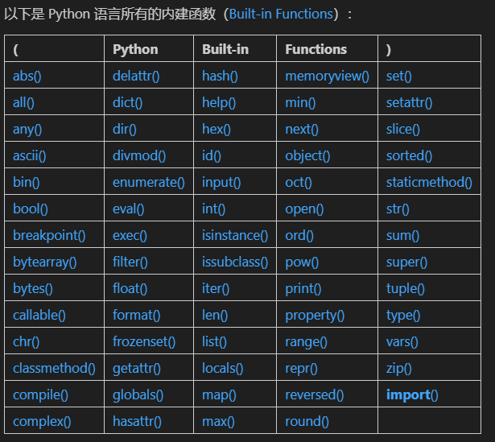

学习目录
# 几个重要概念
## 值及运算
1. 运算+流程控制
2. 质数判断程序：
```python
def is_prime(n):
    if n < 2:
        return  False
    if n==2:
        return  True
    for m in range(2,int(n**0.5)+1):
        if(n%m)==0:
            return False
    else:
        return True
for i in range(80,100):
    if is_prime(i):
        print(i)
```
1) if
2) for
3) for i in range(a,b)
### 值
1. 值
* 常量
* 变量
函数返回值：默认是None
```python
def f():
    pass
print(f())
print(print(f()))
```
在定义f函数时，内部没有return语句，则默认返回None
|函数的本质：把一个值交给某个函数，请其根据自己内部的运算和流程控制对其进行操作后返回另外一个值
举例：
```python
#绝对值
abs(-3.1415926)
#取整
int(abs(-3.1415926))
#浮点
float(int(abs(-3.141592)))
```
2. 值的类型
数据类型：
- 布尔值（Boolean）：True、False
- 数字：整数、浮点数、复数（Complex Number）
- 字符串（String）
相同数据类型才可以运算！
- 类型转换（Type Conversion）
```python
int()、float()、str()、bool()
type()#可以查看值的类型
```
不同类型的值运算时需要确认是同一类型，否则报错。同时可以使用type()查看值的类型，同时进行类型的转换。
### 操作符
1. 数值操作符
加减乘除商余幂：+ - * / // % **
操作有优先级顺序！
2. 布尔值操作符
与、或、非：and or not
优先级：not > and > or
3. 逻辑操作符
小于、小于等于、大于、大于等于、等于、不等于：< <= > >= == !=
优先级：逻辑操作符 > 布尔值操作符 > 数值操作符
4. 字符串操作符
1) 拼接：+和''
2) 拷贝：*
3）逻辑运算：in、not in；以及<、>、<=、>=、==、!=
字符串有其对应的Unicode编码，所以可以进行比较。
5. 列表操作符
python容器（Container）：为了便于批量处理数字和字符串。
1）数组（Array）
2）字符串（String）
3）列表（List）
#列表同字符串，都是有序容器，可以进行拼接，拷贝和逻辑运算以及比较等。
### 更复杂运算
对数值或字符串的操作（加减乘除商余幂、字符串拼接、拷贝、逻辑运算、比较）以及对布尔值（或、与、非）的操作，都属于简单的运算，更为复杂的需要调用函数。
* python内建函数（Built-in Function）：
1. 绝对值abs()
2. 取整int()
3. 浮点数float()
4. 字符串str()
5. 布尔值bool()
6. 类型转换type()
.......

内建函数也依然只能完成“基本操作””，无法完成复杂的运算。
* 更复杂数学运算，还可以调用标准库（Standard Library）中的math模块。
* 类（Class）定义的函数。
### 布尔值补充
|每个变量或者常量，除了它们的值之外，同时还对应着一个布尔值。
### 值的类型补充
1. 等差数列range()
2. 元组tuple()
3. 字典dict()
4. 集合set()
5. 日期date type()
### 总结
程序结构：运算+流程控制
编程是对不同类型的值进行运算，因此每一种值都对应相应的操作方式：
* 操作符
    1. 值运算
    2. 逻辑运算
* 函数
* 内建函数
* 其他模块里的函数
* 其本身所属类之中所定义的函数
接下来的学习：各种数据结构及其操作、操作符和函数。
## 流程控制
分支与循环
### if语句
1. 奇偶数
2. 骰子游戏
### for循环
1. for循环比较其他语言的写法：for a in range(10):
2. range()函数：python的内建函数
    * range(stop)#range默认返回了n-1的整数数列，若需返回n，需要n+1则返回n本身。
    * range(start,stop,[,step])
### CONTINUE和BREAK和PASS
1. CONTINUE
* 忽略continue之后的语句，继续下一次循环
2. BREAK
* 结束当前循环，开始运行循环之后的语句
* PYTHON中比较有个性的地方：for 循环后可以跟一个else语句，当for循环正常结束时，会执行else语句，若循环被break中断，则不会执行else语句。
3. PASS
* 占位语句，不做任何事情，写pass等后面需要完善逻辑了再写。
### while循环
编程语言中提供的两种循环结构：
- Collection-controlled loop:for...in...
- Condition-controlled loop:while...
for更适合处理序列类数据的迭代，while更适合处理条件类数据的迭代。
#### 一个投骰子赌大小的游戏
PASS
### 总结
1. 只处理一种情况：if...
2. 处理True/False两种情况：if...else...
3. 处理多种情况：if...elif...elif...else...
4. 迭代有序数据类型：for...in...,如果需要处理没有break发生的情况，使用for...else...
5. 其他循环：while...
6. 与循环有关的语句还有：continue,break,pass
## 函数
函数实际上是一个可被调用的完整程序。我们只需要学会阅读函数的使用说明书，就可以使用它。
本章目的：学会阅读官方文档函数的说明书，并学会使用函数。  
官方文档：[Built-in Functions](https://docs.python.org/3/library/functions.html)
### 示例print()
#### 基本使用方法
* 传递给它的值输出到屏幕上：
```python
print('line 1st')
print('line 2nd')
print()
print('line 4th')
```
* 一次传递多个参数用，分开，print逐个输出到屏幕上。
```python
print('Hello,', 'jack', 'mike', '...', 'and all you guys!')
```
* 变量或表达式的值插入到字符串中的时候，可以用f-string：
```python
name = 'Ann'
age = '22'
print(f'{name} is {age} years old.')
```
但以上是f-string的用法，f-string中用花括号{}括起来的部分是表达式，最终转换成字符串的时候，那些表达式值会被插入相应的位置...
```python
name = 'Ann'
age = '22'
f'{name} is {age} years old.'
```
#### print()官方文档
> print(*objects, sep=' ', end='\n', file=sys.stdout, flush=False)
> * `sep=' '`：接收多个参数之后，输出时，分隔符号默认为空格，`' '`；
> * `end='\n'`：输出行的末尾默认是换行符号 `'\n'`；
> * `file=sys.stdout`：默认的输出对象是 `sys.stdout`（即，用户正在使用的屏幕）……

### 关键字参数
> * 位置参数(positional argument)arg
> * 关键字参数(keyword argument)kwarg：不提供时，则按默认值
#### sort()函数
> `sorted(iterable, *, key=None, reverse=False)`
### 位置参数
#### divmod(a,b)函数
### 可选位置参数（Optional Positional Arguments）
#### pow()函数，有可选的位置参数
`pow(x,y,[,z])`
> * pow(x,y)————返回值是x**y
> * pow(x,y,z)————返回值是x**y%z
### 可接收很多值的位置参数
#### print()函数
> print(*objects, sep=' ', end='\n', file=sys.stdout, flush=False)
* 第一个位置参数*objects，这个位置可以接收很多个参数（或列表、元组）
#### max()函数
> max(arg1,arg2,*args[,key])
* 多个位置参数时，接收很多值的位置参数只能放置到最后一个位置
### Class也是函数
> 一些内建函数前面也写着Class，比如Class bool([x])，也是一种特殊类型的函数
### 总结
把函数当作一个产品，你是这个产品的用户，学会阅读说明书，注意可选位置参数的使用方法和关键字参数的默认值；函数的定义部分注意[]和=；函数默认返回None；

为了学会使用 Python，你以后最常访问的页面一定是这个：

> * https://docs.python.org/3/library/index.html
>
>   而最早反复阅读查询的页面肯定是其中的这两个：
>   * https://docs.python.org/3/library/functions.html
>   * https://docs.python.org/3/library/stdtypes.html

## 字符串

## 数据容器

## 文件

## 参数

## 化名与匿名

## 递归函数

## 类

## 正则表达式

## 其他