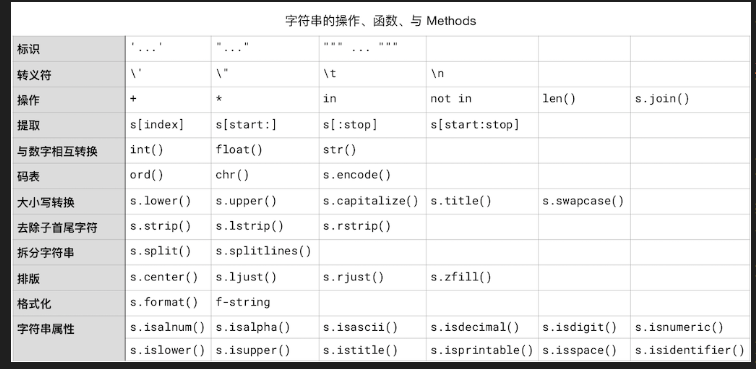
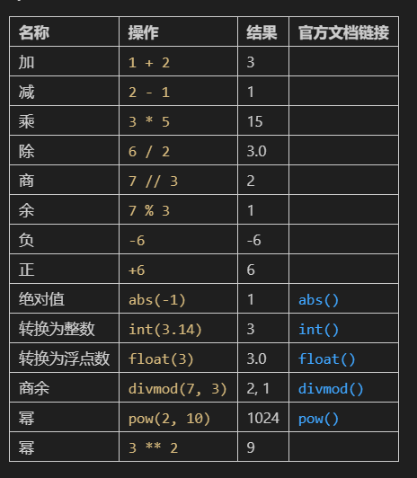

## 字符串
所有的值都要被转换成二进制
### 字符码表的转换
ASCII到Unicode(2^64)
```python
#单个字符转化成码值
ord('a')
#把Unicode码值转化成字符
chr(97)
```
### 字符串的标示
1. 单引号
2. 双引号
3. 三个单引号
4. 三个双引号
### 字符串与数值之间的转换
由数字构成的字符串与数值之间可以相互转换：
```python
#整数
int('3')
#浮点数
float('3.1415926')
#字符串类型
str(3.1415926)
```
input作为内建函数，可以接受一个字符串作为参数，并返回字符串的值。   
> 注意input返回的是字符串，如果需要与数字比较则需要类型转换，直接比较会报错。
> input有一个可选参数，在用户输入之前会把参数输出到屏幕上。
```python
age=input('请输入你的年龄：')
if age<18:
    print('未成年')
else:
    print('成年')
#注意：这里会报错，因为input返回的是字符串，需要转换成数值类型
#直接修改提示语，确保用户输入的是字符串数字，再进行转换：
age=int(input('请输入你的年龄：例如：18'))
if age<18:
    print('未成年')
else:
    print('成年')
#int()将input返回的字符串转换成整数类型
```
### 转义符
> 本身不被当作字符，如果需要在字符串中含有，就得写\\：
```python
"\\"
#有时会遇到字符串的'与字符串中的'相冲突的情况导致了系统误读。
#解决方法：
# 1. 使用转义符
'He said,it\'s fine.'
# 2. 使用双引号
"He said,it's fine."
# 3.习惯使用\'和\"表示字符串内部的引号
"He said,it\'s fine."
```
> 转义符其他用法：制表符和换行符

### 字符串的操作符
1. 拼接：```+```或``` '' ```
2. 复制:```'string'*3```
3. 包含:```'string' in 'string'```
### 字符串的索引
> 字符串属于容器的一种（Container），容器可分为有序和无序两种，字符串属于有序容器，容器中的每个元素都有一个索引，通过索引可以访问到容器中的元素。
> 每个字符串都有一个索引，从0开始，到字符串长度-1
```python
s='hello world'
for char in s:
    print(s.index(char),char)
```
我们可以使用*索引操作符*根据*索引**提取**字符串这个*有序容器*中的*一个或多个元素，即，其中的字符或字符串。这个 “提取” 的动作有个专门的术语，叫做 “Slicing”（切片）。索引操作符 `[]` 中可以有一个、两个或者三个整数参数，如果有两个参数，需要用 `:` 隔开。它最终可以写成以下 4 种形式：

> * `s[index]` —— 返回索引值为 `index` 的那个字符
> * `s[start:]` —— 返回从索引值为 `start` 开始一直到字符串末尾的所有字符
> * `s[start:stop]` —— 返回从索引值为 `start` 开始一直到索引值为 `stop` 的那个字符*之前*的所有字符
> * `s[:stop]` —— 返回从字符串开头一直到索引值为 `stop` 的那个字符*之前*的所有字符
> * `s[start:stop:step]` —— 返回从索引值为 `start` 开始一直到索引值为 `stop` 的那个字符*之前*的，以 `step` 为步长提取的所有字符

提醒：无论是 `range(1,2)`，或者 `random.randrange(100, 1000)` 又或者 `s[start:stop]` 都有一个相似的规律，包含左侧的 `1`, `100`, `start`，不包含右侧的 `2`, `1000`, `stop`。
### 处理字符串的内建函数
```python
from IPython.core.interactiveshell import InteractiveShell
InteractiveShell.ast_node_interactivity = "all"

ord('\n')
ord('\t')
ord('\r')
chr(65) # 与 ord() 相对的函数
s = input('请照抄一遍这个数字 3.14: ')
int('3')
# int(s) 这一句会报错…… 所以暂时注释掉了
float(s) * 9
len(s)
print(s*3)
```
### 处理字符串的Method
字符串一个对象，更准确说是str类（Class str）的对象，它有一些方法（Method），可以用来处理字符串。（类>对象>方法）
#### 大小写转换
```python
str.upper()
str.lower()
str.capitalize()
str.swapcase()
str.casefold()
str..title()
#举例：
s='Now is better than never.'
s.capitalize()#句首字母大写
s.title()#每个单词首字母大写
```
#### 搜索与替换
官方文档是这么写的：
1. str.count
> `str.count(sub[,start[,end]])`

下面的函数说明加了默认值，以便初次阅读更容易理解：

> `str.count(sub [,start=0[, end=len(str)]])`
这里的方括号 `[]` 表示该参数可选；方括号里再次嵌套了一个方括号，这个意思是说，在这个可选参数 `start` 出现的情况下，还可以再有一个可选参数 `end`；

而 `=` 表示该参数有个默认值。上述这段说明如果你感到熟悉的话，说明前面的内容确实阅读到位了…… 与大量 “前置引用” 相伴随的是知识点的重复出现。


> * 只给定 `sub` 一个参数的话，于是从第一个字符开始搜索到字符串结束；
> * 如果，随后给定了一个可选参数的话，那么它是 `start`，于是从 `start` 开始，搜索到字符串结束；
> * 如果 `start` 之后还有参数的话，那么它是 `end`；于是从 `start` 开始，搜索到 `end - 1` 结束（即不包含索引值为 `end` 的那个字符）。
> 
> 返回值为字符串中 `sub` 出现的次数。

注意：字符串中第一个字符的索引值是 `0`。

2. str.find
> 找到sub在字符串中的第一个后，返回索引值，找不到就返回-1
3. str.rfind
> 找到sub在字符串中的最后一个后，返回索引值，找不到就返回-1
4. str.index/str.rindex
> 与str.find/str.rfind类似，但是找不到会报错

5. str.startswitch
```str.startswith(prefix[, start[, end]])```
> 判断prefix字符串是否以某个子字符串起始的
6. str.endswith
```str.endswith(suffix[, start[, end]])```
> 查找suffix是否在目标字符串以子字符串结束的

> 查找前可以使用in来确认子字符串是否存在于目标字符串中

7. str.replace
> 替换字符串中的子字符串
```str.replace(old, new[, count])```
> 替换count个实例
8. str.expandtabs
> 将字符串中的tab转换成空格
```str.expandtabs([tabsize=8])```
```python
s1="Specail\tcases\tare\tsimple"
print(s1.expandtabs(2))
```

#### 去除子字符
1. str.strip([chars])
> 一般用来去除字符串首尾的所有空白，包括空格、TAB、换行符等
```python
s="\r \t Simple is better than complex. \n \t"
s
s.strip()
```
> 如果给定参数，那么参数中所有字母都会被从首尾去除，直到首尾不再包含
```python
s="Simple is better than complex."
s
s.strip("Six.p")# p 全部处理完之后，p 并不在首尾，所以原字符串中的 p 字母不受影响；
s.strip("pSix.mle")# 这一次，首尾的 p 被处理了…… 参数中的字符顺序对结果没有影响，换成 Sipx.mle 也一样……
```
2. str.lstrip()
> 只对左侧处理
```python
#str.lstrip([chars])
s="Simple is better than complex."
s
s.lstrip("Six.p")
s.lstrip("pSix.mle")
```
3. str.rstrip()
> 只对右侧处理
```python
#str.rstrip([chars])
s="Simple is better than complex."
s
s.rstrip("Six.p")
s.rstrip("pSix.mle")
```

#### 拆分字符串
计算机擅长处理格式化的数据，excle或numbers可以导出csv文件，这是文本文件。里面的每一行可能由多个数据构成，数据之间用，分隔。
1. str.splitlines()
> 将字符串拆分成一个列表，每个元素是字符串中的每一行（根据/n或行进行拆分）
2. str.split()
> 根据分隔符进行拆分
> str.split([sep=None,maxsplit=-1])
> 默认按照None（空白\t，\r等）进行拆分，也可以设置成，等。-1表示拆分全部，也可以设置拆分的次数。
3. str.partition()

#### 拼接字符串
1. str.join()
> 将字符串列表拼接成一个字符串
#### 字符串排版
1. str.center()
> 字符串居中，并使用指定字符填充，前提是设定整行长度
```python
#str.center(width[,fillchar])
s='Sparse is better than dense.'
s.title().center(60)
s.title().center(60,'=')
s.title().center(10)#如果宽度参数小于字符串长度，返回原字符串
#字符串向左或右对其
s.title().ljust(60)
s.title().rjust(60,'.')
```
2.  str.zfill()
> 字符串右对齐，使用0填充
```python
#str.zfill(width)
for i in range(1,10):
    filename=str(i).zfill(3)+'.mp3'
    print(filename)
```
#### 格式化字符串
> 格式化字符串指的是特定变量插入字符串指定位置的过程。
1. str.format()
> `str.format(*args, **kwargs)`
作用：
> * 在一个字符串中，插入一个或者多个占位符 —— 用大括号 `{}` 括起来；
> * 而后将 `str.format()` 相应的参数，依次插入占位符中；

2. f-string
#### 使用f-string
> f-string 是 Python 3.6 引入的，它是一种格式化字符串的新方法。
> f-string和str.format()类似，但是写法更简单。
```python
name='John'
age=23
print('{} is {} years old.'.format(name,age))
#不写占位符索引的情况下，默认占位符从0开始，即0，1，2，3...（占位符数量-1）
# 即'{}{}'.format(a,b)和'{0}{1}'.format(a,b)是一样的。

#'{0} is {2} years old.'.format(name,age)会报错，因为占位符索引超出了占位符数量。

#str.format()里可以直接写表达式...
print('{} is a grown up? {} '.format(name,age>=18))

#f-string
name='Jack'
age=25
print(f'{name} is {age} years old')
print(f'{name} is a grown up? {age>=18}')
```
> .format()和f-string的区别：插入占位符和调用format并传参；直接把变量写在占位符里。
> 但.format可以改变参数索引顺序，更为灵活。
```python
name='John'
age=28
'{1} is {0} years old.'.format(name,age)
```
### 字符串属性
字符串一系列Methods，返回的是布尔值，用来判断字符串的构成属性：
1. str.isalnum()
2. str.isalpha()
3. str.isdigit()
4. str.islower()
5. str.isupper()
6. str.isspace()
7. str.istitle()
8. str.isnumeric

```python
# 字符串属性
# 1. isalnum() 判断字符串是否由字母和数字组成
# 2. isalpha() 判断字符串是否由字母组成
# 3. isascii() 
# 4. isdecimal() 判断字符串是否由十进制组成
# 5. isdigit() 判断字符串是否由数字组成
# 6. isnumeric() 判断字符串是否由数字组成
# 7. islower() 判断字符串是否由小写字母组成
# 8. isupper() 判断字符串是否由大写字母组成
# 9. istitle() 判断字符串是否符合标题格式
# 10. isspace() 判断字符串是否由空白字符组成
# 11. isprintable() 判断字符串是否由可打印字符组成
```
....
### 总结





